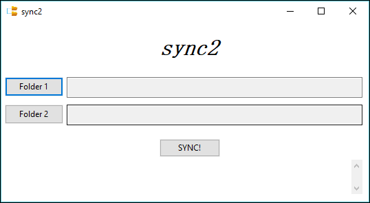

# sync2
sync2 is a stand-alone program that syncs 2 folders.

Just download [sync2.zip](https://github.com/wensheng/sync2/releases/download/0.1/sync2.zip), extract and run sync2.exe.

## Features
It does synchronize 2 folders, and nothing else.  

Here's a feature comparison with other programs:

|              | others         | sync2         |
| :---         |     :---:      |          ---: |
| sync folders | ✅             | ✅    |
| complex UI   | ✅       | ❌      |
| network sync | ✅       | ❌      |
| compare before sync   | ✅       | ❌      |
| one-way option   | ✅       | ❌      |
| scheduled sync   | ✅       | ❌      |
| other features you want   | ✅       | ❌      |

But unlike programs and methods (such as manually copying and pasting folders), it won't ask you annoying questions like if you want to merge folders or if you want to overwriting files.  It also keeps the last modified time of copied folder, unlike the default behavior (using current time) on most OS's.

## Develop
Install wxpython and pyinstaller:

    pip install wxpython pyinstaller
    
Build binary:

    pyinstaller sync2.spec 
    
(You need to change path inside sync2.spec)

## Conflict Resolution
If there is a conflict, i.e., a file in folder 1 has the same path and name as a file in folder 2, but they have different content, both files will be made available in both folders. (The file in folder 1 will be copied to folder 2 under a different name such as filename.1, the file in folder 2 will be copied to folder 1 as filename.2)
